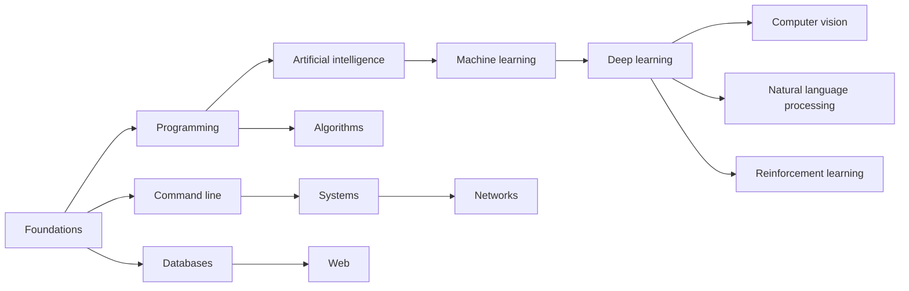

# CS with AI

This is Zach Gao's computer science and artificial intelligence learning library: learning paths, useful open courses, university course outlines and technical articles.

Start with the foundations, then connect programming, systems and AI. Follow the roadmap or use the sidebar and search to find a specific topic.

## Where to start

| Your goal | Suggested starting point |
| --- | --- |
| Build a learning plan | [CS / AI roadmap](ai_map.md) |
| Understand course topics and supporting material | [Course notes and learning resources](ai.md) |
| Explore MIT courses related to AI | [MIT AI course index](mit_AI.md) |
| Review databases, systems and networking | [COMP4039 Databases](4039DIS.md) · [COMP4035 Systems and Networks](SaN.md) |
| Study a technical topic | [Diffusion models](diffusion.md) · [Internet protocols, Part I](networks_1.md) · [Internet protocols, Part II](networks_2.md) |

## Learning roadmap

The diagram shows one possible path. On a phone, scroll within the diagram to read its labels.

[Explore the complete roadmap and course list →](ai_map.md)

## Recent updates

**2026-10-01**: English is now the default language. Use **English / 中文** at the top to switch between the English and Chinese versions of the current page. Navigation, search and article directories follow the selected language.

The site also includes improved chapter links, mobile diagram scrolling and public course outlines.

Years such as 2022 and 2023 in course links refer to the original course editions. “Last organized” refers to maintenance of this library, not an update to the course or verification of every external link. Campus resources are marked when a login is required.

## About this library

Course material belongs to its original authors or institutions. Reproduced articles retain their sources; English translations of Chinese articles are identified as translations. My notes connect resources with learning topics so they are easier to study and revisit.

Read the source in the [GitHub repository](https://github.com/zachgaozihe/docsify), or report broken links and content issues through [Issues](https://github.com/zachgaozihe/docsify/issues).