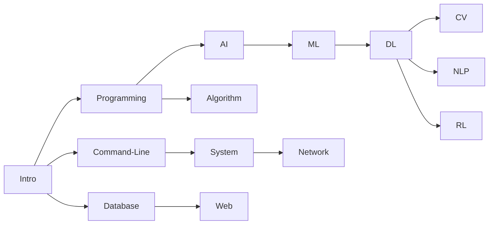

# AI / CS 资源索引

> 最近整理：2026-10-01。日期表示本站内容维护时间，课程年份保留所收录的历史版本；全部外链尚未逐一验证。

本页集中维护课程网站、视频、教材与实验资源。选择学习顺序和查看各类课程的学习关注点，可阅读 [课程说明与学习安排](ai.md)。新增或修正课程链接时优先更新本页。

## Intro

| Module Name                      | Code | Provider                                               | Web                                                          | Video                                                        | Lab                                  | Year |
| -------------------------------- | ---- | ------------------------------------------------------ | ------------------------------------------------------------ | ------------------------------------------------------------ | ------------------------------------ | ---- |
| Crash Course: Computer Science   |      | [Crash Course](https://thecrashcourse.com/topic/computerscience/)   | [🔗](https://github.com/1c7/crash-course-computer-science-chinese?tab=readme-ov-file) | [📺](https://www.bilibili.com/video/BV1EW411u7th) [📽️](https://www.youtube.com/@crashcourse/playlists) |                                      |      |
| Introduction to Computer Science | CS50 | [Harvard](https://cs50.harvard.edu/college/2023/fall/) | [🔗](https://cs50.harvard.edu/x/2023/)                        | [📺](https://www.youtube.com/playlist?list=PLhQjrBD2T380F_inVRXMIHCqLaNUd7bN4) | [💻](https://github.com/csfive/CS50x) | 2023 |

---

## Programming

### Berkeley - CS61A

- Structure and Interpretation of Computer Programs
- [CS 61A Fall 2023](https://cs61a.org/)
- Textbook: [Composing Programs](https://www.composingprograms.com/)
- Textbook-cn: [Composing Programs CN](https://composingprograms.netlify.app/)
- lab: [GitHub - PKUFlyingPig/CS61A](https://github.com/PKUFlyingPig/CS61A)

| Module Name                                            | Code      | Provider | Web                                         | Video                                                        | Lab                                                          | Year |
| ------------------------------------------------------ | --------- | -------- | ------------------------------------------- | ------------------------------------------------------------ | ------------------------------------------------------------ | ---- |
| Introduction to Programming with Python                | CS50P     | Harvard  | [🔗](https://cs50.harvard.edu/python/2022/)  | [📺](https://www.youtube.com/playlist?list=PLhQjrBD2T3817j24-GogXmWqO5Q5vYy0V) | [💻](https://github.com/csfive/CS50P)                         | 2022 |
| Introduction to Computer Science Programming in Python | 6.100A    | MIT      | [🔗](https://introcomp.mit.edu/fall23)       | [📺](https://ocw.mit.edu/courses/6-0001-introduction-to-computer-science-and-programming-in-python-fall-2016/) | [💻](https://github.com/kiraksi/MIT) | 2016 |
| Structure and Interpretation of Computer Programs      | **CS61A** | Berkeley | [🔗](https://cs61a.org/)                     | [📺](https://www.youtube.com/@JohnDeNero/playlists)           | [💻](https://github.com/PKUFlyingPig/CS61A)                   | 2023 |
| Programming Methodology                                | CS106A    | Stanford | [🔗](https://web.stanford.edu/class/cs106a/) | [📺](https://www.youtube.com/playlist?list=PL-h0BZdG_K4myglyF0owcVh9a0oO_arhD)(2017) |                                                              | 2023 |
| Fundamentals of Programming                            | 15-112    | CMU      | [🔗](https://www.cs.cmu.edu/~112/index.html) |                                                              | [💻](https://www.kosbie.net/cmu/spring-23/15-112/schedule.html) | 2023 |

补充历史入口：[CMU 15-112 · Kosbie Spring 2023](https://www.kosbie.net/cmu/spring-23/15-112/index.html)。

---

## Command Line

| Module Name                               | Code   | Provider | Web                                                          | Video                                            | Lab  | Year |
| ----------------------------------------- | ------ | -------- | ------------------------------------------------------------ | ------------------------------------------------ | ---- | ---- |
| The Missing Semester of Your CS Education | 6.null | MIT      | [🔗](https://missing.csail.mit.edu/)                          | [📺 2020 官方视频入口](https://missing.csail.mit.edu/2020/) |      | 2020 |
| The Art of Command Line                   |        |          | [🔗](https://github.com/jlevy/the-art-of-command-line/blob/master/README-zh.md) |                                                  |      | 2023 |
| The Shell Scripting Tutorial              |        |          | [🔗](https://www.shellscript.sh/)                             |                                                  |      | 2023 |

---

## Algorithm

| Module Name                                                  | Code       | Provider | Web                                                          | Video                                                        | Lab  | Year |
| ------------------------------------------------------------ | ---------- | -------- | ------------------------------------------------------------ | ------------------------------------------------------------ | ---- | ---- |
| Introduction to Algorithms                                   | 6.006/121  | MIT      | [🔗](https://ocw.mit.edu/courses/6-006-introduction-to-algorithms-spring-2020/) | [📺](https://ocw.mit.edu/courses/6-006-introduction-to-algorithms-spring-2020/) |      | 2020 |
| Design and Analysis of Algorithms                            | 6.046J     | MIT      | [🔗](https://ocw.mit.edu/courses/6-046j-design-and-analysis-of-algorithms-spring-2015/) |                                                              |      | 2015 |
| [Algorithm Design and Analysis](https://www.csd.cs.cmu.edu/15451651-algorithm-design-and-analysis) | 15-451/651 | CMU      | [🔗](https://www.cs.cmu.edu/~15451-f23/schedule.html)         |                                                              |      | 2023 |
| Design and Analysis of Algorithms                            | CS161      | Stanford | [🔗](https://web.stanford.edu/class/archive/cs/cs161/cs161.1236/index.html) [🔗](https://stanford-cs161.github.io/winter2023/)(winter) |                                                              |      | 2023 |

---

## AI

| Module Name                                                 | Code   | Provider | Web                                              | Video                                                        | Lab  | Year |
| ----------------------------------------------------------- | ------ | -------- | ------------------------------------------------ | ------------------------------------------------------------ | ---- | ---- |
| Introduction to Artificial Intelligence with Python         | CS50AI | Harvard  | [🔗](https://cs50.harvard.edu/ai/2023/)           | [📺](https://www.youtube.com/playlist?list=PLhQjrBD2T382Nz7z1AEXmioc27axa19Kv)(2020) |      | 2023 |
| Introduction to Artificial Intelligence                     | CS188  | Berkeley | [🔗](https://inst.eecs.berkeley.edu/~cs188/fa23/) |                                                              |      | 2023 |
| Artificial Intelligence: Representation and Problem Solving | 15-281 | CMU      | [🔗](https://www.cs.cmu.edu/~15281/)              |                                                              |      | 2023 |
| Artificial Intelligence: Principles and Techniques          | CS221  | Stanford | [🔗](https://stanford-cs221.github.io/)           | [📺](https://www.youtube.com/playlist?list=PLoROMvodv4rO1NB9TD4iUZ3qghGEGtqNX)(2019) |      | 2023 |

---

## Machine Learning

| Module Name                                                  | Code       | Provider | Web                                                          | Video                                                        | Lab                                        | Year |
| ------------------------------------------------------------ | ---------- | -------- | ------------------------------------------------------------ | ------------------------------------------------------------ | ------------------------------------------ | ---- |
| Machine Learning                                             | CS229      | Stanford | [🔗](https://cs229.stanford.edu/)                             | [📺](https://www.youtube.com/playlist?list=PLoROMvodv4rMiGQp3WXShtMGgzqpfVfbU)(2018) | [💻](https://github.com/PKUFlyingPig/CS229) | 2023 |
| Introduction to Machine Learning | CS189/289A | Berkeley | [🔗](https://eecs189.org/) [🔗](https://people.eecs.berkeley.edu/~jrs/189/)(Spring))                                    |                                                              |                                            | 2023 |
| Introduction to Machine Learning (After 15-281 AI)                | 10-315     | CMU      | [🔗](https://www.cs.cmu.edu/~10315/)                          |                                                              |                                            | 2023 |
| Introduction to Machine Learning (easier)                | 10-301/601     | CMU      | [🔗](https://www.cs.cmu.edu/~hchai2/courses/10601/)(Summer)  [🔗](https://www.cs.cmu.edu/~mgormley/courses/10601/)                        |                                                              |                                            | 2023 |
| Introduction To Machine Learning                             | 6.036      | MIT      | [🔗](https://ocw.mit.edu/courses/6-036-introduction-to-machine-learning-fall-2020/) | [📺](https://openlearninglibrary.mit.edu/courses/course-v1:MITx+6.036+1T2019/about) |                                            | 2020 |

---

## Deep Learning

| Module Name                   | Code                                                         | Provider | Web                                                         | Video                                                        | Lab                                                  | Year |
| ----------------------------- | ------------------------------------------------------------ | -------- | ----------------------------------------------------------- | ------------------------------------------------------------ | ---------------------------------------------------- | ---- |
| Deep Learning                 | CS230                                                        | Stanford | [🔗](https://cs230.stanford.edu/)                            | [📺](https://www.youtube.com/playlist?list=PLoROMvodv4rOABXSygHTsbvUz4G_YQhOb)(2018) | [CS230 课程项目](https://cs230.stanford.edu/project/) | 2023 |
| Deep Neural Networks          | CS182/282A                                                   | Berkeley | [🔗](https://inst.eecs.berkeley.edu/~cs182/fa23/)            | [📺](https://www.youtube.com/playlist?list=PLnocShPlK-Fs_62EXCDykgtQFbHGLMT7U) |                                                      | 2023 |
| Introduction to Deep Learning | 11-485/785                                                   | CMU      | [🔗](https://deeplearning.cs.cmu.edu/F23/index.html)         | [📺](https://www.youtube.com/playlist?list=PLp-0K3kfddPzCnS4CqKphh-zT3aDwybDe) |                                                      | 2023 |
| Intermediate Deep Learning    | 10-707 / 417/617                                             | CMU      | [🔗](https://deeplearning-cmu-10707.github.io/)              |                                                              |                                                      | 2019 |
| Deep Learning                 | [HUNG-YI LEE](https://speech.ee.ntu.edu.tw/~hylee/index.html) | NTU      | [🔗](https://speech.ee.ntu.edu.tw/~hylee/ml/2022-spring.php) | [📺](https://www.bilibili.com/video/BV1Wv411h7kN?p=6&vd_source=1c2566d5aa4478055e55db87f43c0143) | [💻](https://github.com/Fafa-DL/Lhy_Machine_Learning) | 2022 |
| Dive into Deep Learning       | Mu Li                                                        |          | [🔗](https://zh.d2l.ai/index.html)                           | [📺](https://space.bilibili.com/1567748478/channel/seriesdetail?sid=358497) |                                                      | 2021 |

补充历史版本：[Berkeley CS182 Spring 2023](https://inst.eecs.berkeley.edu/~cs182/sp23/) · [Spring 2023 视频](https://www.youtube.com/playlist?list=PLnocShPlK-Fuo4Lq1aeyYc6D6Z6C2n2y9)。

---

## Computer Vision

### Michigan - EECS 498.008 / 598.008

- Deep Learning for Computer Vision
- [EECS 498/598 Winter 2022](https://web.eecs.umich.edu/~justincj/teaching/eecs498/WI2022/)
- [Videos](https://www.youtube.com/playlist?list=PL5-TkQAfAZFbzxjBHtzdVCWE0Zbhomg7r)

| Module Name                                            | Code                 | Provider  | Web                                                          | Video                                                        | Lab                            | Year |
| ------------------------------------------------------ | -------------------- | --------- | ------------------------------------------------------------ | ------------------------------------------------------------ | ------------------------------ | ---- |
| Deep Learning for Computer Vision                      | EECS 498.008/598.008 | UMichigan | [🔗](https://web.eecs.umich.edu/~justincj/teaching/eecs498/WI2022/) | [📺](https://www.youtube.com/playlist?list=PL5-TkQAfAZFbzxjBHtzdVCWE0Zbhomg7r)(2019) |                                | 2022 |
| Deep Learning for Computer Vision                      | CS231n               | Stanford  | [🔗](http://cs231n.stanford.edu/)                             | [📺](https://www.youtube.com/playlist?list=PL3FW7Lu3i5JvHM8ljYj-zLfQRF3EO8sYv)(2017) | [💻](https://cs231n.github.io/) | 2023 |
| Intro to Computer Vision and Computational Photography | CS180/280A           | Berkeley  | [🔗](https://inst.eecs.berkeley.edu/~cs180/fa23/)             |                                                              |                                | 2023 |
| Computer Vision                                        | CS280                | Berkeley  | [🔗](https://cs280-berkeley.github.io/)                       |                                                              |                                | 2023 |
| Computer Vision                                        | 16-385               | CMU       | [🔗](https://www.cs.cmu.edu/~16385/)                          |                                                              |                                | 2020 |

---

## Advanced

- [ML 进阶路线图 - CS自学指南](https://csdiy.wiki/%E6%9C%BA%E5%99%A8%E5%AD%A6%E4%B9%A0%E8%BF%9B%E9%98%B6/roadmap/#_6)

---

## More

- [Python for Everybody (PY4E)](https://www.py4e.com/)  
  [Videos](https://www.youtube.com/playlist?list=PLlRFEj9H3Oj7Bp8-DfGpfAfDBiblRfl5p)  
  [Book](https://www.py4e.com/html3/01-intro)

- [Deep Learning Drizzle](https://deep-learning-drizzle.github.io/index.html#mlfund)

- [LearnCS](https://learncs.me/curriculum)

- [Build a Modern Computer from First Principles: From Nand to Tetris](https://www.coursera.org/learn/build-a-computer)

- [OSSU curriculum in CS](https://github.com/ossu/computer-science#core-cs)

- [提问的智慧](https://github.com/ryanhanwu/How-To-Ask-Questions-The-Smart-Way/blob/main/README-zh_CN.md)

## UC Berkeley

### CS 88 / DATA C88C

- Computational Structures in Data Science
- [CS88 2023 Fall](https://c88c.org/fa23/)

### CS 61B

- [课程网站使用介绍](https://sp23.datastructur.es/materials/guides/old/misc/getting-started.html)

## MIT

### MIT - 6.100B (formerly 6.0002)

- Introduction to Computational Thinking and Data Science
- 网站：[6.100A+B](https://introcomp.mit.edu/fall23)

### MIT - 6.100L (formerly 6.0001, full semester version of 6.100A)

- (full semester) Introduction to CS and Programming using Python
- 网站：[6.100L 2023 spring](https://introcomp.mit.edu/6.100L_sp23)

## CMU

- [CMU Recordings](https://scs.hosted.panopto.com/Panopto/Pages/Sessions/List.aspx#view=0&maxResults=250&page=1)

## AI Track

- [CMU Artificial Intelligence Program](http://coursecatalog.web.cmu.edu/schools-colleges/schoolofcomputerscience/artificialintelligence/#curriculumtextcontainer)

- [MIT Artificial Intelligence and Decision Making (Course 6-4)](https://catalog.mit.edu/degree-charts/artifical-intelligence-decision-making-course-6-4/)
- [MIT Computer Science and Engineering (Course 6-3)](https://catalog.mit.edu/degree-charts/computer-science-engineering-course-6-3/)

## Catalog of modules

- [MIT](https://catalog.mit.edu/subjects/6/)

---

## How to choose an Intro ML course at CMU?

The machine learning department offers four different “Introduction to Machine Learning” courses: 10-301/10-601, 10-315, 10-701, and 10-715, as well as a preparatory course 10-606/10-607. All four “Introduction” courses have a similar goal: to introduce students to the theory and practice of machine learning. That is, students who take these courses will be able to:

●    select and apply appropriate machine learning algorithms for a given learning problem

●    modify existing learning algorithms to apply to novel situations, and implement the modified algorithms

●    read and understand research papers about machine learning algorithms

However, the courses differ in their assumed background, their relative emphasis on these goals, and their pace. This page is intended to help students choose which course is right for them.

### Based on your program

If you are a student in one of the following programs, we recommend…

●    PhD students

○    MLD PhD: 10-715

○    non-MLD SCS PhD: 10-701

○    non-SCS PhD: 10-601

●    MS students

○    MLD MS: 10-701 or 10-715

○    non-MLD SCS MS: 10-601 or 10-701

○    non-SCS MS: 10-601

●    Undergraduate students

○    SCS undergraduate planning to apply for 5th-year MS in MLD: 10-315 (or occasionally 10-701, but 5th-year MSML credit for 10-701 can be obtained by completing 15-281 and 10-315)

○    SCS undergraduate: 10-315

○    non-SCS undergraduate planning to complete a double major in SCS: 10-315

○    non-SCS undergraduate: 10-301

### Based on what courses you want to take next

Most advanced machine learning courses will accept any of these courses as a prerequisite. However, most students in the 700-level advanced ML courses (e.g. 10-703, 10-707, 10-708) will have taken 10-701 or 10-715. Most students in the 600-level advanced ML courses (e.g. 10-605, 10-617, 10-618) will have taken 10-601. Most students in the 400-level advanced ML courses (e.g. 10-403, 10-405, 10-417) will have taken 10-301 or 10-315.

### Based on your prerequisite knowledge

Students choosing between 10-601 and 10-701 (e.g. non-MLD SCS MS students), may want to gauge their own mathematical preparedness in order to choose between the two courses.

If you have completed a full-semester undergraduate course on ***all\*** of the following topics, then you are likely prepared for 10-701.

1. Probability     & Statistics
2. Linear     Algebra
3. Multivariate     Calculus
4. Discrete     Math (sets, logic, combinatorics) - you ***must\*** be proficient     with writing proofs
5. Intermediate     Programming

If you have not completed ***all\*** of the above coursework as an undergraduate, then we recommend 10-601. Undergraduates taking 10-301, which is cross-listed with 10-601 and has the same content, will have completed a full semester course on each of the following topics:

1. Probability     (not Statistics)
2. Univariate     Calculus
3. Discrete     Math
4. Intermediate     Programming

## Comparison of the ML courses in CMU

**10-715:** This course is intended for PhD students in the Machine Learning Department. It is the fastest-paced and most mathematical of the courses. In addition to the goals listed above, 10-715 is intended to prepare students to write research papers that rely on and contribute to machine learning. PhD students from closely-related departments (such as CSD or RI) might consider this course if their research depends strongly on and contributes to machine learning. MS students in MLD have the option of taking 10-715 or 10-701. It is not offered to undergraduate students.

**10-701:** This course is intended for PhD students with a strong mathematical and programming background. It focuses more on the mathematical foundations of machine learning than on applications. Students must be comfortable writing proofs. It is typically the appropriate course for PhD students in SCS departments other than machine learning, or for MS students in MLD. PhD students from outside SCS could consider 10-701 if they have a very strong background in math and programming, including linear algebra, probability, and matrix calculus. To gain the required background, non-MLD SCS MS students may take one or both minis of 10-606/607 then 10-701.

**10-315:** This course is intended for undergraduates in SCS. Unlike 10-301, the course is not paced to allow students with incomplete backgrounds to catch up; however, students who do well in the prerequisite and corequisite courses will have sufficient background to do well in 10-315. Because one of the main audiences for this course are AI majors who have taken 15-281 *Introduction to Artificial Intelligence*, this course typically does not cover certain topics that are introduced in 15-281 such as reinforcement learning and Bayesian networks.

**10-301/10-601:** Students in this course have the most diverse collection of backgrounds. The most typical student is an MS student from SCS or a non-SCS undergraduate; but the course is intended to allow students from anywhere in the university, including those whose mathematical backgrounds may be rusty or incomplete, to catch up and do well. However, the course is mathematically rigorous and contains both programming and derivations in its homeworks, so students should expect to do extra work in proportion to the amount of background that they are missing. Compared to 10-701, this class is more focused on practical applications and is appropriate for a student who wants to take just one ML class at CMU. Taking one or both minis of 10-606/607 before 10-601 can make it easier to do well in 10-601.

**10-606/607:** This two-mini course sequence provides a single place for students to gain the necessary mathematical / computational background necessary for further study in machine learning – particularly for 10-601 and 10-701. These courses are intended for MS and PhD students in SCS or outside SCS. The topics are covered quickly and under the assumption that the student will have seen at least some of these topics before, but need additional depth and practice. **10-606** covers mathematical background for ML. Topics covered include linear algebra, multivariate differential calculus, and probability. **10-607** covers computer science background for ML. Topics covered include proof techniques, computational complexity, data structures, and algorithms.
