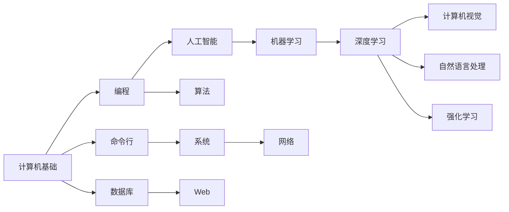

# CS with AI

这里是 Zach Gao 的计算机科学与人工智能学习知识库，记录学习路线、值得参考的公开课程、大学课程提纲和技术文章。

从基础开始，逐步连接编程、系统和 AI。你可以按路线学习，也可以通过左侧目录和搜索直接查找某个主题。

## 从哪里开始

| 你的目标 | 推荐入口 |
| --- | --- |
| 建立完整的学习顺序 | [CS / AI 学习路线](ai_map.md) |
| 了解课程内容与配套资料 | [课程说明与学习资源](ai.md) |
| 查找 MIT 的 AI 相关课程 | [MIT AI 课程索引](mit_AI.md) |
| 阅读数据库、系统与网络课程提纲 | [COMP4039 数据库](4039DIS.md) · [COMP4035 系统与网络](SaN.md) |
| 理解具体技术主题 | [扩散模型](diffusion.md) · [互联网协议（一）](networks_1.md) · [互联网协议（二）](networks_2.md) |

## 学习路线

下图是一条可参考的路径。手机上可以横向滑动图表查看文字。

[查看完整学习路线与课程清单 →](ai_map.md)

## 最近更新

**2026-10-01**：网站默认以英文显示，顶部 **English / 中文** 可以切换当前页面的语言。中文版使用独立入口，导航、搜索和本页目录也会随之切换。

此前已整理首页与内容导航，修复章节跳转，改善手机图表阅读，并将课程页面整理成公开的学习提纲。

课程链接中保留的 2022、2023 等年份表示原课程版本。文章中的“本站整理日期”表示本次内容整理时间，不代表课程更新或所有外链已重新验证。校内资料会标注需要登录。

## 关于这个知识库

课程资料归原作者或学校所有；转载文章保留来源。本人的整理用于连接资料与学习主题，方便循序学习和日后查阅。

欢迎通过 [GitHub 仓库](https://github.com/zachgaozihe/docsify)查看原文，或在 [Issues](https://github.com/zachgaozihe/docsify/issues)反馈失效链接和内容问题。
