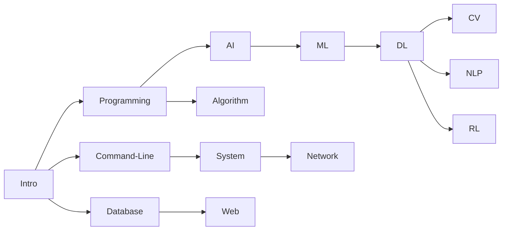

# AI / CS 资源索引

> 最近整理：2026-10-01。日期表示本站内容维护时间，课程年份保留所收录的历史版本；全部外链尚未逐一验证。

本页集中维护课程网站、视频、教材与实验资源。选择学习顺序和查看各类课程的学习关注点，可阅读 [课程说明与学习安排](ai.md)。新增或修正课程链接时优先更新本页。

## Intro

| 课程名称                      | 编号 | 提供方                                               | 网站                                                          | 视频                                                        | 实验                                  | 年份 |
| -------------------------------- | ---- | ------------------------------------------------------ | ------------------------------------------------------------ | ------------------------------------------------------------ | ------------------------------------ | ---- |
| Crash Course: Computer Science   |      | [Crash Course](https://thecrashcourse.com/topic/computerscience/)   | [🔗](https://github.com/1c7/crash-course-computer-science-chinese?tab=readme-ov-file) | [📺](https://www.bilibili.com/video/BV1EW411u7th) [📽️](https://www.youtube.com/@crashcourse/playlists) |                                      |      |
| Introduction to Computer Science | CS50 | [Harvard](https://cs50.harvard.edu/college/2023/fall/) | [🔗](https://cs50.harvard.edu/x/2023/)                        | [📺](https://www.youtube.com/playlist?list=PLhQjrBD2T380F_inVRXMIHCqLaNUd7bN4) | [💻](https://github.com/csfive/CS50x) | 2023 |

---

## Programming

### Berkeley - CS61A

- Structure and Interpretation of Computer Programs
- [CS 61A Fall 2023](https://cs61a.org/)
- 教材： [Composing Programs](https://www.composingprograms.com/)
- 中文教材： [Composing Programs CN](https://composingprograms.netlify.app/)
- 实验： [GitHub - PKUFlyingPig/CS61A](https://github.com/PKUFlyingPig/CS61A)

| 课程名称                                            | 编号      | 提供方 | 网站                                         | 视频                                                        | 实验                                                          | 年份 |
| ------------------------------------------------------ | --------- | -------- | ------------------------------------------- | ------------------------------------------------------------ | ------------------------------------------------------------ | ---- |
| Introduction to Programming with Python                | CS50P     | Harvard  | [🔗](https://cs50.harvard.edu/python/2022/)  | [📺](https://www.youtube.com/playlist?list=PLhQjrBD2T3817j24-GogXmWqO5Q5vYy0V) | [💻](https://github.com/csfive/CS50P)                         | 2022 |
| Introduction to Computer Science Programming in Python | 6.100A    | MIT      | [🔗](https://introcomp.mit.edu/fall23)       | [📺](https://ocw.mit.edu/courses/6-0001-introduction-to-computer-science-and-programming-in-python-fall-2016/) | [💻](https://github.com/kiraksi/MIT) | 2016 |
| Structure and Interpretation of Computer Programs      | **CS61A** | Berkeley | [🔗](https://cs61a.org/)                     | [📺](https://www.youtube.com/@JohnDeNero/playlists)           | [💻](https://github.com/PKUFlyingPig/CS61A)                   | 2023 |
| Programming Methodology                                | CS106A    | Stanford | [🔗](https://web.stanford.edu/class/cs106a/) | [📺](https://www.youtube.com/playlist?list=PL-h0BZdG_K4myglyF0owcVh9a0oO_arhD)(2017) |                                                              | 2023 |
| Fundamentals of Programming                            | 15-112    | CMU      | [🔗](https://www.cs.cmu.edu/~112/index.html) |                                                              | [💻](https://www.kosbie.net/cmu/spring-23/15-112/schedule.html) | 2023 |

补充历史入口：[CMU 15-112 · Kosbie Spring 2023](https://www.kosbie.net/cmu/spring-23/15-112/index.html)。

---

## Command Line

| 课程名称                               | 编号   | 提供方 | 网站                                                          | 视频                                            | 实验  | 年份 |
| ----------------------------------------- | ------ | -------- | ------------------------------------------------------------ | ------------------------------------------------ | ---- | ---- |
| The Missing Semester of Your CS Education | 6.null | MIT      | [🔗](https://missing.csail.mit.edu/)                          | [📺 2020 官方视频入口](https://missing.csail.mit.edu/2020/) |      | 2020 |
| The Art of Command Line                   |        |          | [🔗](https://github.com/jlevy/the-art-of-command-line/blob/master/README-zh.md) |                                                  |      | 2023 |
| The Shell Scripting Tutorial              |        |          | [🔗](https://www.shellscript.sh/)                             |                                                  |      | 2023 |

---

## Algorithm

| 课程名称                                                  | 编号       | 提供方 | 网站                                                          | 视频                                                        | 实验  | 年份 |
| ------------------------------------------------------------ | ---------- | -------- | ------------------------------------------------------------ | ------------------------------------------------------------ | ---- | ---- |
| Introduction to Algorithms                                   | 6.006/121  | MIT      | [🔗](https://ocw.mit.edu/courses/6-006-introduction-to-algorithms-spring-2020/) | [📺](https://ocw.mit.edu/courses/6-006-introduction-to-algorithms-spring-2020/) |      | 2020 |
| Design and Analysis of Algorithms                            | 6.046J     | MIT      | [🔗](https://ocw.mit.edu/courses/6-046j-design-and-analysis-of-algorithms-spring-2015/) |                                                              |      | 2015 |
| [Algorithm Design and Analysis](https://www.csd.cs.cmu.edu/15451651-algorithm-design-and-analysis) | 15-451/651 | CMU      | [🔗](https://www.cs.cmu.edu/~15451-f23/schedule.html)         |                                                              |      | 2023 |
| Design and Analysis of Algorithms                            | CS161      | Stanford | [🔗](https://web.stanford.edu/class/archive/cs/cs161/cs161.1236/index.html) [🔗](https://stanford-cs161.github.io/winter2023/)(winter) |                                                              |      | 2023 |

---

## AI

| 课程名称                                                 | 编号   | 提供方 | 网站                                              | 视频                                                        | 实验  | 年份 |
| ----------------------------------------------------------- | ------ | -------- | ------------------------------------------------ | ------------------------------------------------------------ | ---- | ---- |
| Introduction to Artificial Intelligence with Python         | CS50AI | Harvard  | [🔗](https://cs50.harvard.edu/ai/2023/)           | [📺](https://www.youtube.com/playlist?list=PLhQjrBD2T382Nz7z1AEXmioc27axa19Kv)(2020) |      | 2023 |
| Introduction to Artificial Intelligence                     | CS188  | Berkeley | [🔗](https://inst.eecs.berkeley.edu/~cs188/fa23/) |                                                              |      | 2023 |
| Artificial Intelligence: Representation and Problem Solving | 15-281 | CMU      | [🔗](https://www.cs.cmu.edu/~15281/)              |                                                              |      | 2023 |
| Artificial Intelligence: Principles and Techniques          | CS221  | Stanford | [🔗](https://stanford-cs221.github.io/)           | [📺](https://www.youtube.com/playlist?list=PLoROMvodv4rO1NB9TD4iUZ3qghGEGtqNX)(2019) |      | 2023 |

---

## Machine Learning

| 课程名称                                                  | 编号       | 提供方 | 网站                                                          | 视频                                                        | 实验                                        | 年份 |
| ------------------------------------------------------------ | ---------- | -------- | ------------------------------------------------------------ | ------------------------------------------------------------ | ------------------------------------------ | ---- |
| Machine Learning                                             | CS229      | Stanford | [🔗](https://cs229.stanford.edu/)                             | [📺](https://www.youtube.com/playlist?list=PLoROMvodv4rMiGQp3WXShtMGgzqpfVfbU)(2018) | [💻](https://github.com/PKUFlyingPig/CS229) | 2023 |
| Introduction to Machine Learning | CS189/289A | Berkeley | [🔗](https://eecs189.org/) [🔗](https://people.eecs.berkeley.edu/~jrs/189/)(Spring))                                    |                                                              |                                            | 2023 |
| Introduction to Machine Learning (After 15-281 AI)                | 10-315     | CMU      | [🔗](https://www.cs.cmu.edu/~10315/)                          |                                                              |                                            | 2023 |
| Introduction to Machine Learning (easier)                | 10-301/601     | CMU      | [🔗](https://www.cs.cmu.edu/~hchai2/courses/10601/)(Summer)  [🔗](https://www.cs.cmu.edu/~mgormley/courses/10601/)                        |                                                              |                                            | 2023 |
| Introduction To Machine Learning                             | 6.036      | MIT      | [🔗](https://ocw.mit.edu/courses/6-036-introduction-to-machine-learning-fall-2020/) | [📺](https://openlearninglibrary.mit.edu/courses/course-v1:MITx+6.036+1T2019/about) |                                            | 2020 |

---

## Deep Learning

| 课程名称                   | 编号                                                         | 提供方 | 网站                                                         | 视频                                                        | 实验                                                  | 年份 |
| ----------------------------- | ------------------------------------------------------------ | -------- | ----------------------------------------------------------- | ------------------------------------------------------------ | ---------------------------------------------------- | ---- |
| Deep Learning                 | CS230                                                        | Stanford | [🔗](https://cs230.stanford.edu/)                            | [📺](https://www.youtube.com/playlist?list=PLoROMvodv4rOABXSygHTsbvUz4G_YQhOb)(2018) | [CS230 课程项目](https://cs230.stanford.edu/project/) | 2023 |
| Deep Neural Networks          | CS182/282A                                                   | Berkeley | [🔗](https://inst.eecs.berkeley.edu/~cs182/fa23/)            | [📺](https://www.youtube.com/playlist?list=PLnocShPlK-Fs_62EXCDykgtQFbHGLMT7U) |                                                      | 2023 |
| Introduction to Deep Learning | 11-485/785                                                   | CMU      | [🔗](https://deeplearning.cs.cmu.edu/F23/index.html)         | [📺](https://www.youtube.com/playlist?list=PLp-0K3kfddPzCnS4CqKphh-zT3aDwybDe) |                                                      | 2023 |
| Intermediate Deep Learning    | 10-707 / 417/617                                             | CMU      | [🔗](https://deeplearning-cmu-10707.github.io/)              |                                                              |                                                      | 2019 |
| Deep Learning                 | [HUNG-YI LEE](https://speech.ee.ntu.edu.tw/~hylee/index.html) | NTU      | [🔗](https://speech.ee.ntu.edu.tw/~hylee/ml/2022-spring.php) | [📺](https://www.bilibili.com/video/BV1Wv411h7kN?p=6&vd_source=1c2566d5aa4478055e55db87f43c0143) | [💻](https://github.com/Fafa-DL/Lhy_Machine_Learning) | 2022 |
| Dive into Deep Learning       | Mu Li                                                        |          | [🔗](https://zh.d2l.ai/index.html)                           | [📺](https://space.bilibili.com/1567748478/channel/seriesdetail?sid=358497) |                                                      | 2021 |

补充历史版本：[Berkeley CS182 Spring 2023](https://inst.eecs.berkeley.edu/~cs182/sp23/) · [Spring 2023 视频](https://www.youtube.com/playlist?list=PLnocShPlK-Fuo4Lq1aeyYc6D6Z6C2n2y9)。

---

## Computer Vision

### Michigan - EECS 498.008 / 598.008

- Deep Learning for Computer Vision
- [EECS 498/598 Winter 2022](https://web.eecs.umich.edu/~justincj/teaching/eecs498/WI2022/)
- [视频](https://www.youtube.com/playlist?list=PL5-TkQAfAZFbzxjBHtzdVCWE0Zbhomg7r)

| 课程名称                                            | 编号                 | 提供方  | 网站                                                          | 视频                                                        | 实验                            | 年份 |
| ------------------------------------------------------ | -------------------- | --------- | ------------------------------------------------------------ | ------------------------------------------------------------ | ------------------------------ | ---- |
| Deep Learning for Computer Vision                      | EECS 498.008/598.008 | UMichigan | [🔗](https://web.eecs.umich.edu/~justincj/teaching/eecs498/WI2022/) | [📺](https://www.youtube.com/playlist?list=PL5-TkQAfAZFbzxjBHtzdVCWE0Zbhomg7r)(2019) |                                | 2022 |
| Deep Learning for Computer Vision                      | CS231n               | Stanford  | [🔗](http://cs231n.stanford.edu/)                             | [📺](https://www.youtube.com/playlist?list=PL3FW7Lu3i5JvHM8ljYj-zLfQRF3EO8sYv)(2017) | [💻](https://cs231n.github.io/) | 2023 |
| Intro to Computer Vision and Computational Photography | CS180/280A           | Berkeley  | [🔗](https://inst.eecs.berkeley.edu/~cs180/fa23/)             |                                                              |                                | 2023 |
| Computer Vision                                        | CS280                | Berkeley  | [🔗](https://cs280-berkeley.github.io/)                       |                                                              |                                | 2023 |
| Computer Vision                                        | 16-385               | CMU       | [🔗](https://www.cs.cmu.edu/~16385/)                          |                                                              |                                | 2020 |

---

## Advanced

- [ML 进阶路线图 - CS自学指南](https://csdiy.wiki/%E6%9C%BA%E5%99%A8%E5%AD%A6%E4%B9%A0%E8%BF%9B%E9%98%B6/roadmap/#_6)

---

## More

- [Python for Everybody (PY4E)](https://www.py4e.com/)  
  [Videos](https://www.youtube.com/playlist?list=PLlRFEj9H3Oj7Bp8-DfGpfAfDBiblRfl5p)  
  [教材](https://www.py4e.com/html3/01-intro)

- [Deep Learning Drizzle](https://deep-learning-drizzle.github.io/index.html#mlfund)

- [LearnCS](https://learncs.me/curriculum)

- [Build a Modern Computer from First Principles: From Nand to Tetris](https://www.coursera.org/learn/build-a-computer)

- [OSSU curriculum in CS](https://github.com/ossu/computer-science#core-cs)

- [提问的智慧](https://github.com/ryanhanwu/How-To-Ask-Questions-The-Smart-Way/blob/main/README-zh_CN.md)

## UC Berkeley

### CS 88 / DATA C88C

- Computational Structures in Data Science
- [CS88 2023 Fall](https://c88c.org/fa23/)

### CS 61B

- [课程网站使用介绍](https://sp23.datastructur.es/materials/guides/old/misc/getting-started.html)

## MIT

### MIT - 6.100B (formerly 6.0002)

- Introduction to Computational Thinking and Data Science
- 网站：[6.100A+B](https://introcomp.mit.edu/fall23)

### MIT - 6.100L (formerly 6.0001, full semester version of 6.100A)

- (full semester) Introduction to CS and Programming using Python
- 网站：[6.100L 2023 spring](https://introcomp.mit.edu/6.100L_sp23)

## CMU

- [CMU Recordings](https://scs.hosted.panopto.com/Panopto/Pages/Sessions/List.aspx#view=0&maxResults=250&page=1)

## AI Track

- [CMU Artificial Intelligence Program](http://coursecatalog.web.cmu.edu/schools-colleges/schoolofcomputerscience/artificialintelligence/#curriculumtextcontainer)

- [MIT Artificial Intelligence and Decision Making (Course 6-4)](https://catalog.mit.edu/degree-charts/artifical-intelligence-decision-making-course-6-4/)
- [MIT Computer Science and Engineering (Course 6-3)](https://catalog.mit.edu/degree-charts/computer-science-engineering-course-6-3/)

## Catalog of modules

- [MIT](https://catalog.mit.edu/subjects/6/)

---

## How to choose an Intro ML course at CMU?

机器学习系提供四种 Introduction to Machine Learning 课程：10-301/10-601、10-315、10-701 和 10-715，以及准备课程 10-606/10-607。四种入门课的共同目标是介绍机器学习的理论与实践。完成课程后，学生应能够：

●    针对给定的学习问题，选择并应用适合的机器学习算法

●    修改现有学习算法以适应新的情境，并实现修改后的算法

●    阅读并理解有关机器学习算法的研究论文

不过，这些课程对背景知识的要求、对上述目标的侧重和教学进度不同。以下说明用于帮助学生选择适合的课程。

### 根据所属项目选择

根据所属项目，原课程说明给出的建议如下：

●    博士生

○    MLD 博士：10-715

○    非 MLD 的 SCS 博士：10-701

○    非 SCS 博士：10-601

●    硕士生

○    MLD 硕士：10-701 或 10-715

○    非 MLD 的 SCS 硕士：10-601 或 10-701

○    非 SCS 硕士：10-601

●    本科生

○    计划申请 MLD 第 5 年硕士项目的 SCS 本科生：10-315（偶尔也可选择 10-701，但完成 15-281 和 10-315 后可以获得第 5 年 MSML 项目中对应 10-701 的学分）

○    SCS 本科生：10-315

○    计划完成 SCS 双专业的非 SCS 本科生：10-315

○    非 SCS 本科生：10-301

### 根据后续课程选择

大多数高阶机器学习课程接受以上任意一种入门课作为先修课。不过，700 级高阶 ML 课程（例如 10-703、10-707、10-708）的多数学生已修过 10-701 或 10-715；600 级课程（例如 10-605、10-617、10-618）的多数学生已修过 10-601；400 级课程（例如 10-403、10-405、10-417）的多数学生已修过 10-301 或 10-315。

### 根据先修知识选择

在 10-601 和 10-701 之间选择的学生，例如非 MLD 的 SCS 硕士生，可以评估自己的数学准备程度。

如果已完成以下**全部**主题的完整学期本科课程，通常具备学习 10-701 的准备：

1. 概率与统计
2. 线性代数
3. 多元微积分
4. 离散数学（集合、逻辑、组合数学）：**必须**熟练书写证明
5. 中级编程

如果本科阶段尚未完成以上**全部**课程，原说明建议选择 10-601。10-301 与 10-601 联合开课且内容相同；选择本课程的本科生应已完成以下各主题的完整学期课程：

1. 概率（不含统计）
2. 一元微积分
3. 离散数学
4. 中级编程

## CMU 机器学习课程对比

**10-715：**面向机器学习系博士生，是这些课程中进度最快、数学要求最高的一门。除上述目标外，10-715 还帮助学生准备撰写依赖机器学习并对该领域有所贡献的研究论文。如果研究高度依赖机器学习且对其有所贡献，相关院系（如 CSD 或 RI）的博士生也可以考虑。MLD 硕士生可以选择 10-715 或 10-701。本科生不能选修。

**10-701：**面向数学与编程基础扎实的博士生，较应用更侧重机器学习的数学基础，要求学生熟练书写证明。通常适合 SCS 中非机器学习系的博士生，或 MLD 硕士生。非 SCS 博士生如果在线性代数、概率和矩阵微积分等方面具备很强的数学与编程基础，也可考虑 10-701。非 MLD 的 SCS 硕士生可先修 10-606/607 中的一门或两门短学期课程，再修 10-701。

**10-315：**面向 SCS 本科生。与 10-301 不同，课程进度不会为背景不完整的学生额外留出补习时间；不过，先修和共修课程成绩良好的学生应具备学好 10-315 的基础。主要受众之一是已修 15-281 *Introduction to Artificial Intelligence* 的 AI 专业学生，因此通常不再讲授 15-281 中介绍过的部分主题，例如强化学习和贝叶斯网络。

**10-301/10-601：**学生背景最为多样，典型学生是 SCS 硕士生或非 SCS 本科生。课程允许全校学生参加，也给数学基础生疏或不完整的学生提供追赶进度的机会。不过，课程数学要求严谨，作业同时包含编程和推导，因此缺少的背景越多，需要投入的额外学习越多。与 10-701 相比，更侧重实际应用，适合只计划在 CMU 修一门 ML 课程的学生。在学习 10-601 前先修 10-606/607 中的一门或两门短学期课程，可以帮助学好 10-601。

**10-606/607：**两门短学期课程构成的序列，为进一步学习机器学习提供所需的数学与计算基础，尤其针对 10-601 和 10-701。面向 SCS 或其他院系的硕士生和博士生。讲授进度较快，假定学生已接触过部分主题，但需要进一步深入和练习。**10-606** 介绍 ML 的数学背景，包括线性代数、多元微分学和概率。**10-607** 介绍 ML 的计算机科学背景，包括证明技术、计算复杂度、数据结构和算法。
